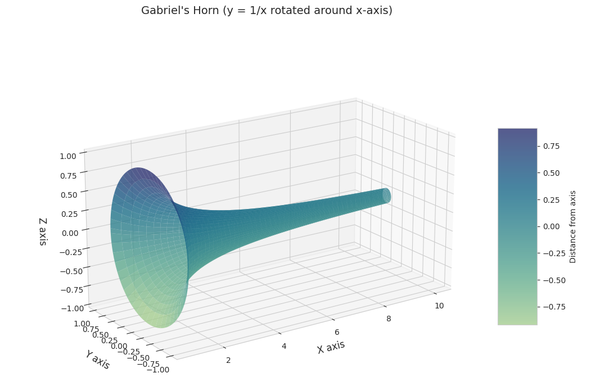
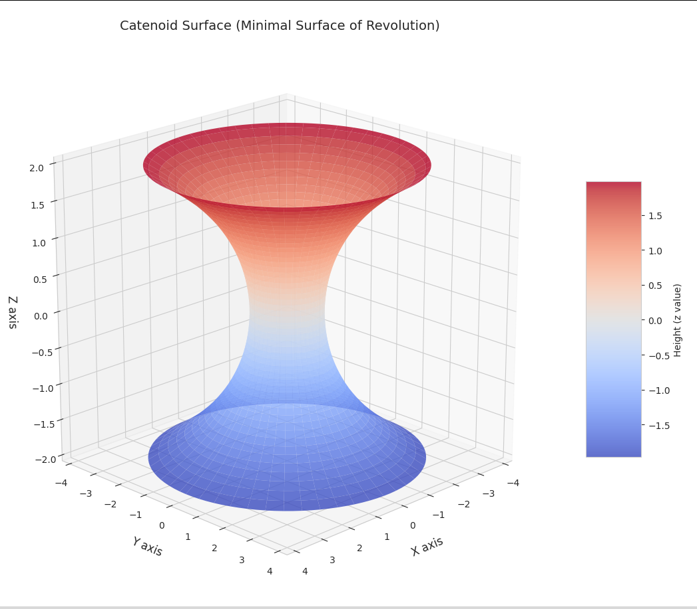
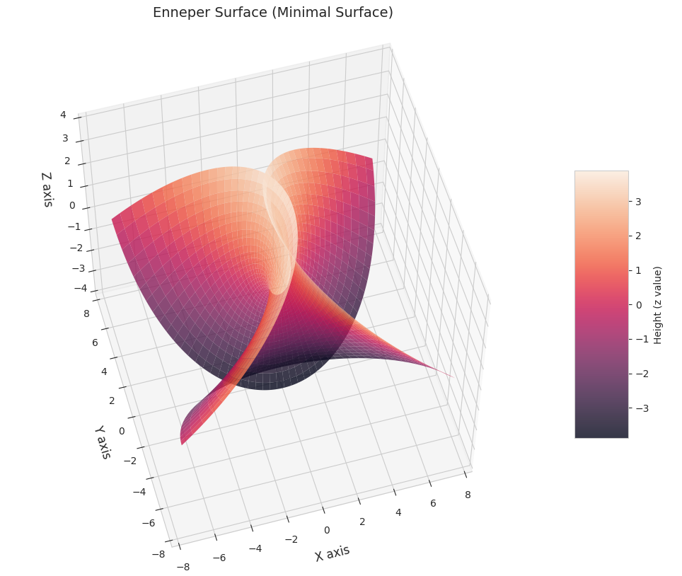

# A repo of curious mathematical shapes and other stuff

Contains simple code to generate the following visualizations using nothing but numpy and matplotlib.

### [Monkey Saddle](shapes/monkey_saddle.md)

### [Gabriel's Horn](shapes/gabriels_horn.md)

### [Catenoid](shapes/catenoid.md)

### [Enneper Surface](shapes/enneper.md)

