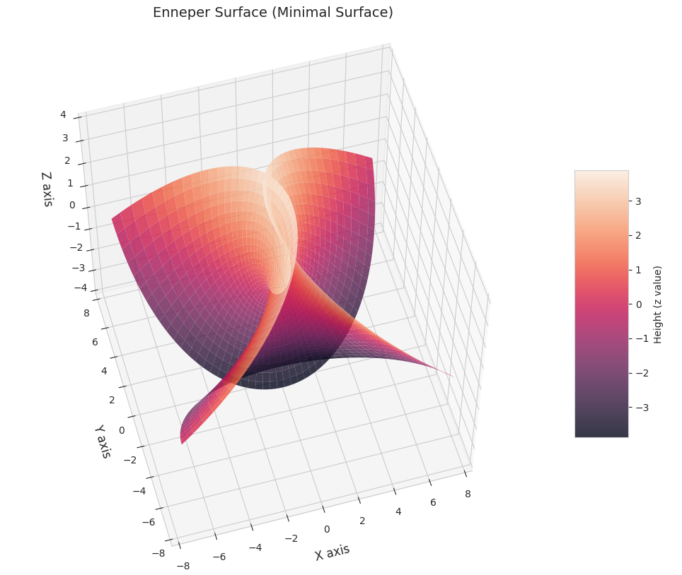

# Mathematical Properties of the Enneper Surface

## Basic Definition

The Enneper surface, discovered by Alfred Enneper in 1864, is a self-intersecting minimal surface that demonstrates several remarkable mathematical properties. It arises naturally from one of the simplest possible choices of the Weierstrass-Enneper representation of minimal surfaces.

## Parameterization

The surface is defined by the following parametric equations for parameters $$u$$ and $$v$$:

$$x(u,v) = u - \frac{u^3}{3} + uv^2$$
$$y(u,v) = v - \frac{v^3}{3} + vu^2$$
$$z(u,v) = u^2 - v^2$$

## Key Mathematical Properties

### 1. Minimality

- The surface has zero mean curvature ($$H = 0$$) at every point
- This makes it a minimal surface, meaning it locally minimizes its surface area
- It solves the Euler-Lagrange equation for the area functional:
  $$\frac{\partial}{\partial x}\left(\frac{F_x}{\sqrt{1 + |\nabla F|^2}}\right) + \frac{\partial}{\partial y}\left(\frac{F_y}{\sqrt{1 + |\nabla F|^2}}\right) = 0$$
- The minimality property can be verified through the first and second fundamental forms

### 2. Gaussian Curvature

- The Gaussian curvature $$K$$ at any point $$(u,v)$$ is given by:
  $$K = -\frac{4}{(1 + u^2 + v^2)^2}$$
- Properties of the curvature:
  - K < 0 everywhere except at the origin
  - K = -4 at the origin (u = v = 0)
  - K -> 0 as u^2 + v^2 -> ∞
  - The curvature is rotationally symmetric about the z-axis

### 3. Complex Analysis Connection

- The Enneper surface can be generated from the complex function $$f(z) = z$$
- Using the Weierstrass-Enneper representation:
  - The surface is generated by $$\omega(z) = z$$ and $$g(z) = z$$
  - The parametric equations are derived from:
    $$
    \begin{align*}
    X &= \Re\int (1-g^2)\omega\,dz \\
    Y &= \Re\int i(1+g^2)\omega\,dz \\
    Z &= \Re\int 2g\omega\,dz
    \end{align*}
    $$
- The parameterization is conformal (angle-preserving)

### 4. Topological Properties

- Self-intersections:
  - The surface intersects itself infinitely many times
  - The self-intersections occur at points where different $$(u,v)$$ pairs map to the same $$(x,y,z)$$ coordinates
  - Each branch of the surface passes through itself at regular intervals
- Symmetry:
  - The surface has $$D_4$$ symmetry (dihedral group of order 8)
  - It is symmetric about the $$xy$$-plane
  - It has rotational symmetry of order 4 about the $$z$$-axis

### 5. Boundary Behavior

- The surface extends infinitely in all directions
- As parameters increase:
  - Growth is characterized by $$\|(x,y,z)\| \sim O(r^3)$$ as $$\|(u,v)\| = r \to \infty$$
  - The distance between ruffles grows linearly
  - The amplitude grows cubically

### 6. Differential Geometric Properties

- First Fundamental Form coefficients:
  $$
  \begin{align*}
  E &= 1 + u^2 + v^2 \\
  F &= 0 \\
  G &= 1 + u^2 + v^2
  \end{align*}
  $$
- Second Fundamental Form coefficients:
  $$
  \begin{align*}
  L &= \frac{2}{1 + u^2 + v^2} \\
  M &= 0 \\
  N &= -\frac{2}{1 + u^2 + v^2}
  \end{align*}
  $$
- Mean curvature:
  $$H = \frac{EN - 2FM + GL}{2(EG - F^2)} = 0$$

### 7. Area and Growth Properties

- For a region bounded by $$|u|,|v| \leq r$$:
  - The area grows as $$O(r^4)$$
  - The perimeter grows as $$O(r^3)$$
  - The area element is given by $$dA = (1 + u^2 + v^2)\,du\,dv$$
- The total area over any bounded region can be computed using:
  $$A = \iint\limits_R \sqrt{EG - F^2}\,du\,dv = \iint\limits_R (1 + u^2 + v^2)\,du\,dv$$

### 8. Physical Applications

- The surface appears in:
  - Soap film experiments under specific boundary conditions
  - Studies of minimal surface networks
  - Models of certain biological membranes
- Its self-intersecting nature makes it more of mathematical interest than practical application

### 9. Connection to Other Mathematical Objects

- Related to:
  - Higher-order Enneper surfaces $$E_n$$ defined by $$g(z) = z^n$$
  - Henneberg surface (another minimal surface)
  - Catalan surface
- Generalizations exist in higher dimensions and for different metric spaces

## Historical Significance

- Discovered during the golden age of minimal surface theory
- Helped establish connections between:
  - Complex analysis
  - Differential geometry
  - Minimal surface theory
- Served as a prototype for understanding more complex minimal surfaces

## Computational Aspects

- Can be efficiently computed and visualized
- Serves as a test case for minimal surface algorithms
- Numerical stability issues arise when computing far from the origin due to cubic growth
- Error analysis shows that numerical errors grow as $$O(r^6)$$ for parameter values of magnitude $$r$$

This surface remains an important example in differential geometry and minimal surface theory, combining beautiful mathematical properties with relatively simple parametric equations.
